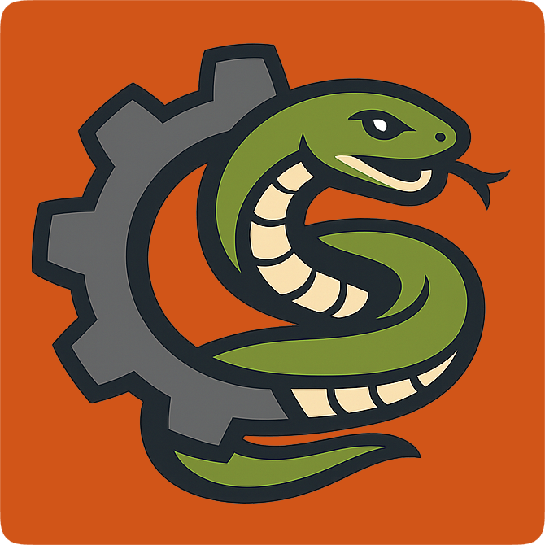
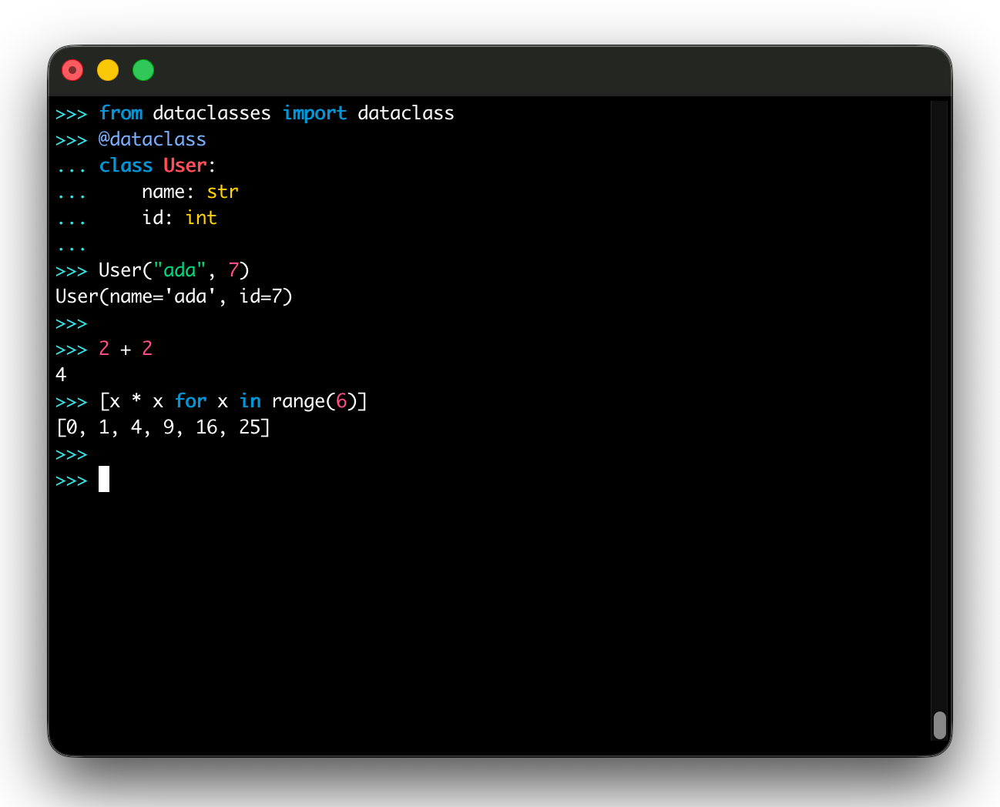
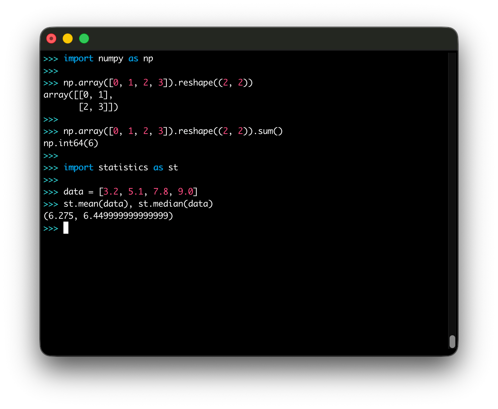

<p align="center">
  
</p>

<h1 align="center">PYRS</h1>

<p align="center"><strong>A Python interpreter in Rust targeting CPython 3.14 semantics.</strong></p>

<p align="center">
  <a href="#quick-start">Quick Start</a>
  ·
  <a href="#installation">Installation</a>
  ·
  <a href="#usage">Usage</a>
  ·
  <a href="#status">Status</a>
  ·
  <a href="#docs">Docs</a>
  ·
  <a href="#contributing">Contributing</a>
</p>

## At a Glance

| Area | Current State |
| --- | --- |
| Compatibility target | CPython 3.14 |
| Core execution paths | Source (`.py`), bytecode (`.pyc`), interactive REPL |
| Platform priority | macOS + Linux (`x86_64`, `aarch64`) |
| C-extension support | In progress (scientific stack bring-up underway) |
| Local test runner | `cargo nextest run` |

## REPL Preview

<p align="center">
  
  
</p>

## Quick Start

Install from GitHub with Cargo:

```bash
cargo install --locked --git https://github.com/BlueBlazin/pyrs --bin pyrs
pyrs --version
```

Run interactive REPL:

```bash
pyrs
```

Run inline Python:

```bash
pyrs -c "import platform; print(platform.python_version())"
```

Run a script:

```bash
pyrs path/to/script.py
```

## Installation

### Cargo (recommended)

```bash
cargo install --locked --git https://github.com/BlueBlazin/pyrs --bin pyrs
```

### Cargo install from local repo path

```bash
git clone https://github.com/BlueBlazin/pyrs.git
cd pyrs
cargo install --locked --path .
```

### Build from source (no install)

```bash
git clone https://github.com/BlueBlazin/pyrs.git
cd pyrs
cargo build --release
./target/release/pyrs --version
```

### Homebrew (tap)

```bash
brew install blueblazin/tap/pyrs
```

### Docker nightly

```bash
docker pull ghcr.io/blueblazin/pyrs:nightly
docker run --rm -it ghcr.io/blueblazin/pyrs:nightly
```

### Nightly archives

Nightly binary archives are published at:

- [GitHub Releases (nightly tag)](https://github.com/BlueBlazin/pyrs/releases/tag/nightly)

## Usage

### CLI execution modes

```bash
pyrs                         # REPL (or stdin when piped)
pyrs path/to/script.py       # source file
pyrs path/to/module.pyc      # CPython bytecode file
pyrs -c "print('hello')"     # inline source
```

### Useful flags

```bash
pyrs --help
pyrs --version
pyrs -S path/to/script.py
pyrs --ast path/to/script.py
pyrs --bytecode path/to/script.py
```

### REPL shortcuts

```text
:help   :clear   :paste   :timing   :reset   :quit
```

### Environment knobs

```text
PYRS_CPYTHON_LIB   explicit CPython stdlib root
PYRS_REPL_THEME    auto | dark | light
PYTHONPATH         additional import search paths
```

## Status

PYRS is an active pre-release project with CPython 3.14 parity as the correctness target.

### What works today

- Broad pure-Python runtime surface (modules/packages, classes, comprehensions, generators, core async/threading flows).
- CPython bytecode execution for supported `.pyc` surfaces.
- Interactive REPL with multiline input, history, syntax highlighting, and command utilities.
- Large and growing stdlib support coverage.

### In progress

- Long-tail CPython parity closure across stdlib/runtime edge behavior.
- Broader C-extension compatibility closure (NumPy/scientific-stack parity work).
- Additional performance and hardening milestones.

## Testing

Run the local suite with `nextest`:

```bash
cargo nextest run
```

Use `cargo test` only when you specifically need `cargo test` semantics:

```bash
cargo test
```

## Docs

- Website/docs source: [`website/`](website/)
- Project roadmap: [`docs/ROADMAP.md`](docs/ROADMAP.md)
- Compatibility tracker: [`docs/COMPATIBILITY.md`](docs/COMPATIBILITY.md)
- Production readiness tracker: [`docs/PRODUCTION_READINESS.md`](docs/PRODUCTION_READINESS.md)
- Stub/partial parity ledger: [`docs/STUB_ACCOUNTING.md`](docs/STUB_ACCOUNTING.md)

## Contributing

PRs and focused bug reports are welcome.

- For CPython parity mismatches, include a minimal reproducer and both CPython + PYRS output.
- For implementation workflow expectations in this repo, see [`AGENTS.md`](AGENTS.md).
